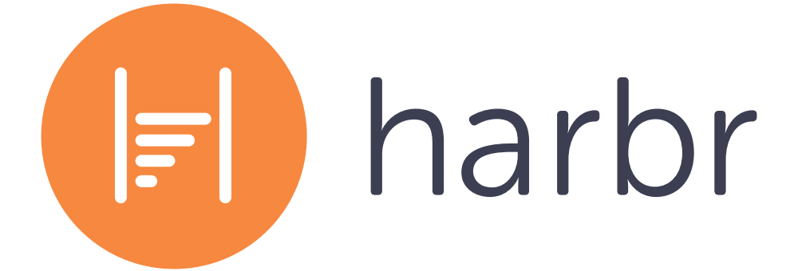
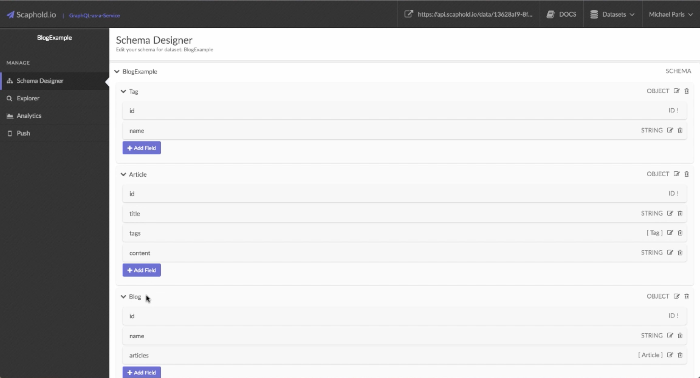
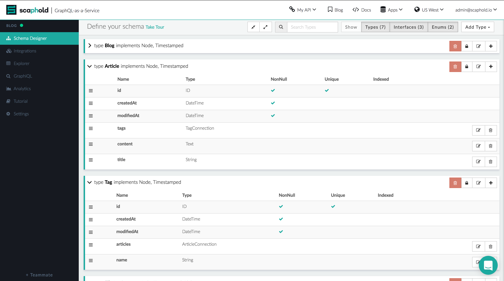

## Powering the next generation of apps

## Hi there!

It’s been seven months since we launched our first version of Scaphold. As with any newborn startup, we as the founders were energized by the flood of exciting directions we could take this platform. Amongst the million and a half tasks that we had in front of us that all seemed equally beneficial, the toughest by far was trying to distill these scattered ideas into one cohesive goal.

> **Rapid product development**

And while we built more features and talked to more users, we were scaling linearly. The platform itself wasn’t designed for all that we wanted to build. Hard problems included expanding our integrations portal, custom filtering for queries, user experience, and many more. So we rebuilt most of Scaphold to address these needs and more.

The latest version is built entirely with the user in mind, centralizing our features towards helping you build your next dream idea, your next billion-dollar app. Scaphold is fully-featured with an overhaul of the user interface, API, and built to scale exponentially. We spent thousands of hours talking to users about their specific needs, whether it be via email, Slack, or even in person. And we’re more than pleased with the results.

Today, we’re pleased to announce that **Scaphold is the fastest-growing and most feature-rich backend as a service platform in the market**. With thousands of apps on the platform and counting, we’re elated to share highlights of our 2016 experience with you!

## Events

Ever since day 1, we’ve been excited about people building apps. So we set forth to seek out thriving tech hubs. We’ve been across the U.S. hosting tech events alongside top companies like Microsoft, Google, and Amazon to help grow the community of app developers. Most notably, we sponsored the first ever GraphQL Summit. [Read about it here!](https://scaphold.io/blog/state-of-graphql)

It’s been such a fruitful and rewarding effort teaching people about this amazing new technology called GraphQL and how they can get start using it instantly with Scaphold.

Here’s what we’ve been up to in the community:

> Meetups & Tech Talks: **23**

> Hackathons: **8**

> Podcasts: **3**

> Number of people reached: **20,000+**

## Companies

Needless to say, one of the most exciting elements of building Scaphold is working with our very own customers. These guys have felt the magic in the platform, and have launched amazing apps faster than ever before. Here are a few of our favorites:

1. #### [**Bonnier**](http://www.bonniercorp.com/): Redefining what a media company can be

    

2. #### [**OpenCastings**](https://www.opencastings.com/): The best way to find acting jobs

    

3. #### [**Harbr**](http://www.harbr.com/): Construction analytics & reporting

    

If you’d like to show off what you’ve built with Scaphold, we’d love to feature you in our next blog post! Feel free to email us at [community@scaphold.io](mailto:community@scaphold.io) and tell us about yourself.

## Product

The evolution of Scaphold over the last several months speaks for itself.  

> **Initial Launch** (May 2016)

  

> **Now** (December 2016)

  

All in all, it was a great year for app development. We’ve made tremendous strides to bringing you the fastest and most cohesive experience so you can focus on what matters most to you:

<h4 style="text-align: center"><a href="https://scaphold.io?signupModal=true"><b>Your App.</b></a></h4>

We’re excited to continue marching forward in revolutionizing the app development experience.
Love what you’re building and excited to hear what Scaphold has in store for you in 2017?

* [**Follow us on Slack!**](http://slack.scaphold.io)
* [**Tell your friends. Get $25.**](https://scaphold.io/referral)

 

We wish you a happy holiday season, and can’t wait to see what you build next.

> And don't forget to have some fun while doing it!

 

  
